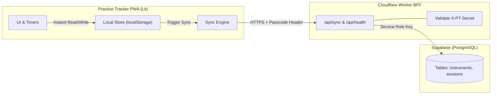

# Backend Architecture & Cloud Sync Specification

This document details the backend architecture for Practice Tracker, integrating a Cloudflare Worker BFF and Supabase PostgreSQL database for persistent, cross-device synchronization.

## Architecture Overview

## Core Decisions
- **Single-User Secret Gateway**: Cloudflare Worker holds the Supabase Service Role Key and Supabase URL. The client authenticates to the worker using an `X-PT-Secret` header configured in the app's settings modal.
- **Local-First Resilience**: All UI interactions and timer logs write immediately to local storage for zero latency and full offline support.
- **Tombstones (`deleted_at`)**: Deletions record a deletion timestamp to propagate cleanly across multiple devices without accidental resurrection.
- **Delta Sync Protocol**: A single `POST /api/sync` atomic endpoint reconciles changes since `lastSyncedAt` using Last-Write-Wins (LWW) timestamp logic.
- **Monorepo Worker**: Worker source code, Wrangler configuration, and database migration SQL live in `/worker`.

## Specifications & Documentation
- [Cloud Sync Specification](./cloud-sync-spec.md)
- [ADR 0001: Local-First Cloud Sync via Cloudflare Worker BFF and Supabase](./adr/0001-local-first-cloud-sync-via-cloudflare-bff.md)
- [ADR 0002: Tombstone-Based Sync Reconciliation and Monorepo Worker](./adr/0002-tombstone-sync-and-worker-monorepo.md)
- [ADR 0003: Bidirectional Delta Sync Protocol](./adr/0003-bidirectional-delta-sync-protocol.md)

